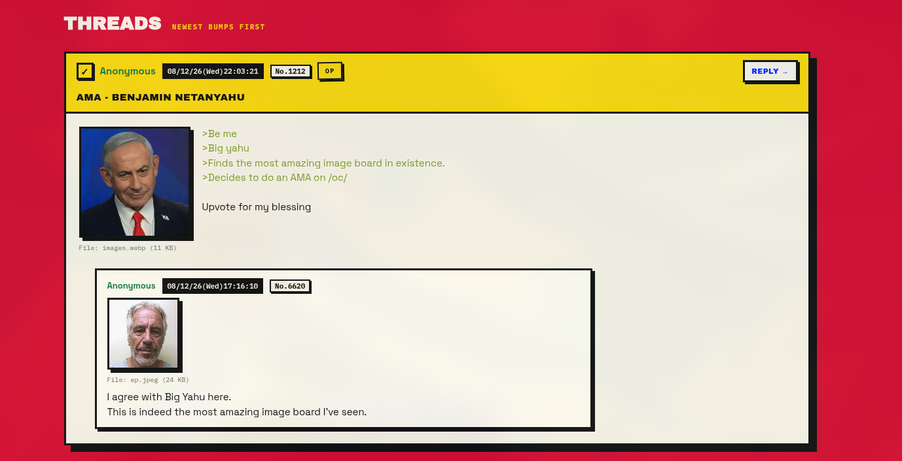
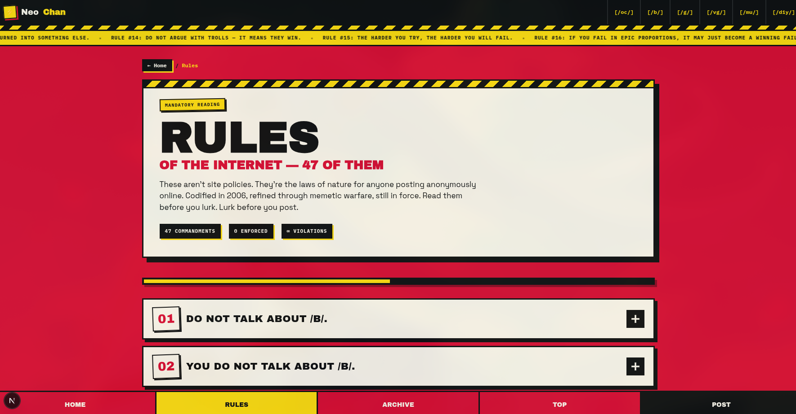
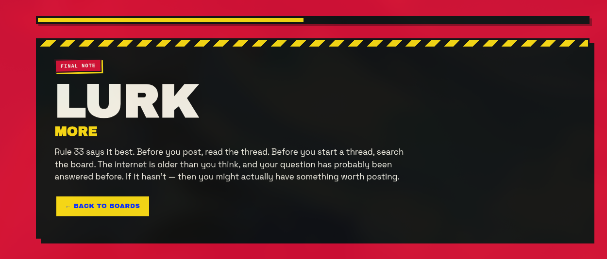
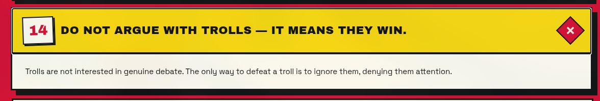
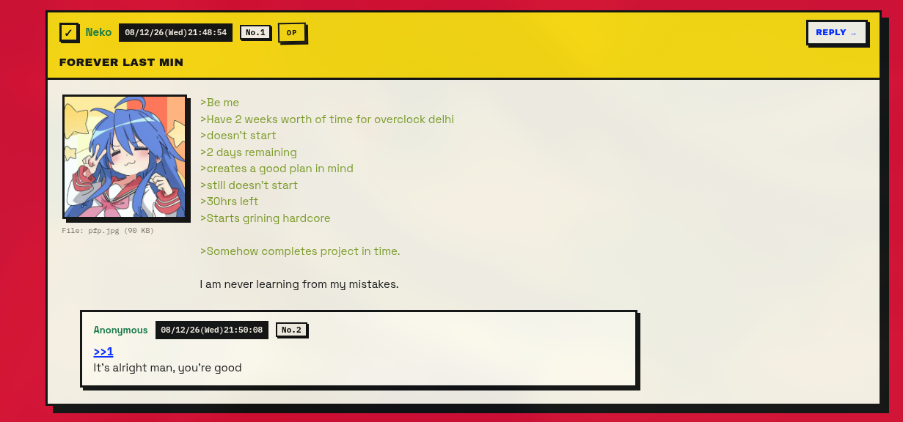
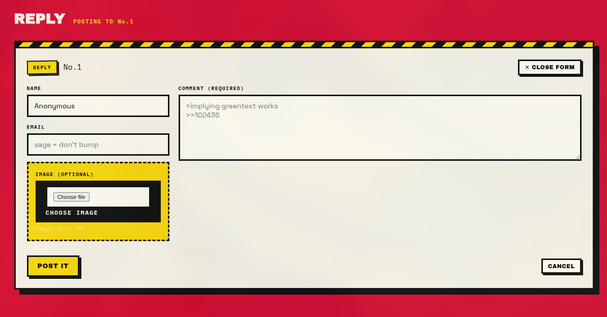

# Neochan

A modern age imageboard with brutalized UI.
Bringing back the Anonymity the internet once promised.

## Screenshots








## Why I made this

I was really fond of the internet and the anonymity it provided but in recent years internet has changed, changed a lot. It's no long as Anonymous as it used to be. People have been creating personalities. Even on platforms which call themselves anonymous(discord or reddit) after a while there is an Identitiy which starts to be created around you, You may become a seperate person there, A name, A Idenitity you can't get rid off.
Acting a certain way which matches your character, constraining yourself.

<br>

Although NeoChan is different, you are an Anon just an ANON. NO SHAPE, NO IDENTITY. No personality. _**NO DIGITAL FOOTPRINT**_ <br>
It provides you with freedom, Freedom of thought, Freedom of speech, Freedom from consequences. \_**Freedom to be yourself.**
<br>
You and your Idenitity vanish as soon as the thread ends. My motive to create this project was to bring the internet somewhat near to the shape it once was, The glory days.

## Tech Stack

- NextJS
- Typescript
- Redis

I've used Nextjs App router and typescript for the project, with redis as the database, and for hosting the images I am using [uploadthing](https://uploadthing.com/) by the creator [Theo - t3.gg](https://twitter.com/theodavt) as an S3 Solution. Although in future I would probably be moving to cloudflare R2 since the speeds aren't he best here. I've been using upstash for my redis DB cause sweet free tier.

## How it works

There are different image boards on the site for different topics, User can create a thread although we have strict ratelimits since you don't need to signup to use our site(Will implement captcha per write interaction later if needed). The creator of the thread is OP and others can reply to that thread. 

> _It's important to upload an image when creating a thread_

The way it works is ,the max amount of threads a board can have is _**67**_ Once the count exceeds, the board deletes the thread with the least amount of activity. 

Activity is counted via bumps, each bump decreases the age of the thread in the eyes of the algorithm. The most dead thread gets terminated. 

There is also a role called _Sage_ , if you reply to a thread with Sage enabled, it won't bump the thread on your reply. One can use it to show dis-appreciate op for a low quality post. 

When the user makes a post, then first the app makes a request to uploadthing to store the image, uploadthing returns a url to that image, this url is then stored in my redis db with other details of the thread. 

### Why redis?
Well it's super fast, initially I decided on redis because of the inbuild TTL(Time to Live) feature it provides, although decided to implement purging a different way. So didn't ended up using the TTL feature, despite that I did't require much storage for text messages and having a super fast DB for scanning links between replies and other stuff is nice. although would have to replace uploadthing with something faster, R2 mayhaps. 


Other features like greentext and replies are similar to how 4chan.org works.


## Run Locally

### 1. Prerequisites
- **Node.js**: v18.17+ or v20+
- **Upstash Redis**: A free Redis database from [Upstash](https://upstash.com/)
- **UploadThing**: An API token from [UploadThing](https://uploadthing.com/) for media uploads

### 2. Clone the Repository
```bash
git clone https://github.com/AaravAtGit/NeoChan.git
cd NeoChan
```

### 3. Install Dependencies
```bash
npm install

```

### 4. Configure Environment Variables
Create a `.env.local` file in the root directory (or copy `.env.example`):

```bash
cp .env.example .env.local
```

Fill in your credentials in `.env.local`:

```env
# Upstash Redis REST credentials
UPSTASH_REDIS_REST_URL="https://your-database.upstash.io"
UPSTASH_REDIS_REST_TOKEN="your_upstash_redis_rest_token"

# UploadThing API token
UPLOADTHING_TOKEN="your_uploadthing_token"
```

### 5. Start the Development Server
```bash
npm run dev

```

Open [http://localhost:3000](http://localhost:3000) in your browser.

---

### Scripts

| Command | Description |
| --- | --- |
| `npm run dev` | Starts Next.js development server |
| `npm run build` | Builds the production application |
| `npm run start` | Runs the built application in production mode |
| `npm run lint` | Runs ESLint check |


-- -

Made with 🩵 by [AaravAtGit](https://github.com/AaravAtGit/)